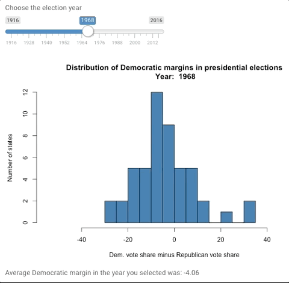
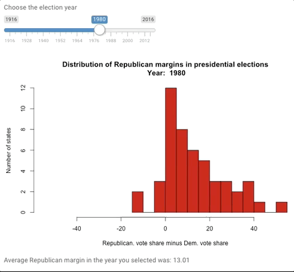
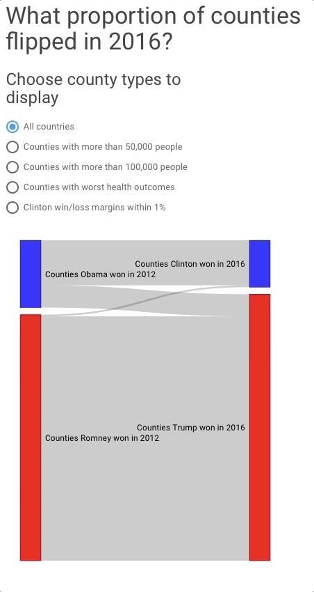
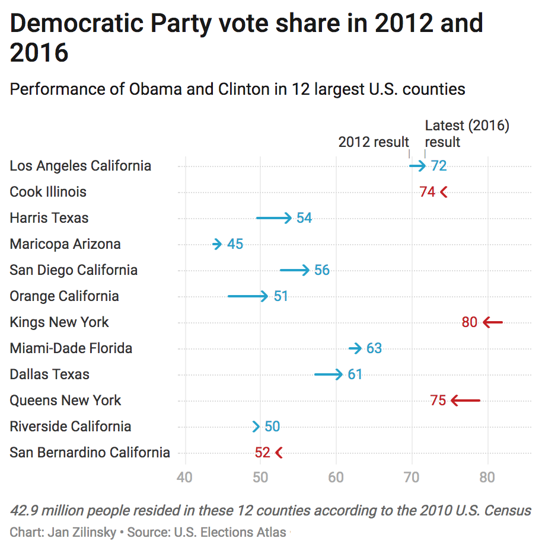
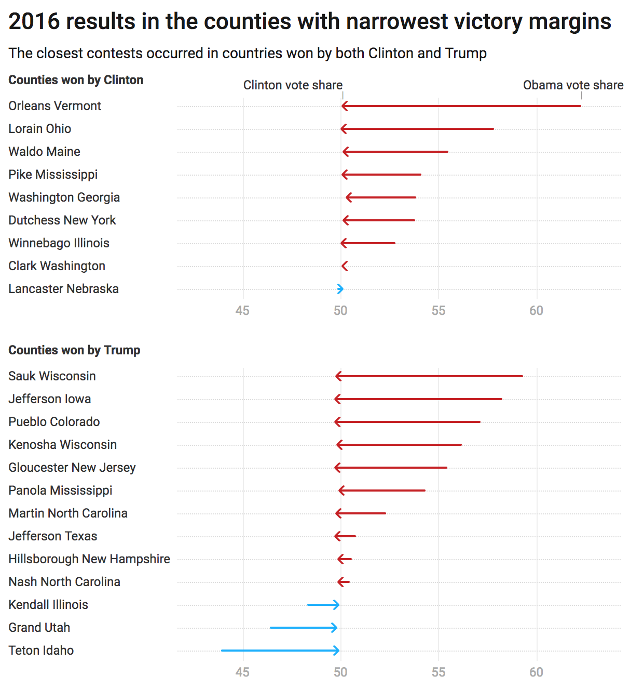

**Motivating questions:**  If America is a country divided into a blue and red states, there would be a risk that political candidates to take most states for granted. But is partisan polarization is as severe today as some people believe? And how has political landscape changed compared to 50 or 100 years ago?

Second, how did voting patterns in 2016 compared to what happened in 2012? In other words, was 2016 a revolutionary year, or just a normal election?

## U.S. voting behavior over time (1916-2016). How competitive are U.S. presidential elections?

The objective of this project is to create a set of graphs that comply with the principles of good data visualization: namely, the charts should be *insightful*, but also *simple* enough for readers to digest the main message of each exhibit.

**Main product**: A self-contained Shiny app shows how the number "swing states" hinges on what we choose to count as a competitive election (at the state level). Most data journalists and researchers use data for recent elections; the app present will allow you to look at patterns for the last 25 U.S. presidential elections.

Access the set of visualizations via [shinyapp.io](https://zilinsky.shinyapps.io/how_competitive_are_us_elections/), or see the animations below.

**Product 2**: Using sankey plots, display county-level vote changes between 2012 and 2016. The user can choose to focus on a particular state, or to select counties that meet a specific condition.

**Third**, I represent recent election results, with `ggplot`. The idea is to show where voting for the incumbent party decreased between 2012 and 2016. Lastly, I will display the change in Democratic party vote shares in a number of interesting counties, and in the largest counties (by population) where a surprsingly large number of people lives.

```{r Setup, include=FALSE, results='hide', warning=FALSE}
library(knitr)
library(tidyverse)
library(RColorBrewer)
library(ggthemes)
library(ggrepel)
library(viridis) # Some useful color palettes
library(forcats) # This is needed for fct_reorder(f,x,fun)
library(ggridges) # this used to be the ggjoy package
library(ggjoy) # this is only needed for theme_joy(), not for joyplots themselves
library(waffle) # for making square / waffle charts

# Interactive viz
library(htmlwidgets)
library(DT)
library(d3heatmap)
#library(dygraphs)

opts_chunk$set(fig.path="images/",
               cache.path="cache/",
               cache=FALSE,
               echo=TRUE,
               message=FALSE,
               warning=FALSE)  

# Load own theme
jz.theme <- function(base_size = 9, base_family = "",
                     grid.x_colour = NA, grid.y_colour = NA,
                     grid.x_linetype = 1, grid.y_linetype = 1,
                     background_colour = "transparent",
                     plot_background_colour = "transparent",
                     tick_colour = "black", tick_length = 0.2){
  theme(
    axis.text=element_text(size=12), # Increase the size of labels
    axis.title=element_text(size=14), # Increase the size of axis titles
    axis.title.x = element_text(vjust=.5,hjust=.8), # Move x-axis title to the right 
    axis.title.y = element_text(vjust=.5,hjust=.8), # Move y-axis title up
    panel.background = element_blank(),
    legend.key = element_blank(),
    legend.key.size = unit(0.7, "lines"),
    legend.text = element_text(family = base_family, size = base_size, face = "plain", lineheight = 1),
    legend.text.align = -1, 
    legend.title = element_blank(),
    legend.title.align = 1,
    legend.position = "top",
    legend.direction = "horizontal",
    legend.justification = c(0, 1)
  )
}

# Load own colors
mycols <- brewer.pal(3,"Set1")
jzcolors <- c("deepskyblue4","darkslateblue","cadetblue4","brown3","mediumpurple4")
jz_brewer3cats <- c("#1B9E77","#D95F02","#7570B3")
jz_brewer <- c("#762A83","#C2A5CF","#D9F0D3","#A6DBA0","#5AAE61","#1B7837")
```  


## How many states were competitive between 1916 and 2016?

What should count as a narrow victory? Some analysts say that an election is competitive is the two main parties perform within a 3 percentage points margin.

Of course, such a cutoff at 3 percentage points is arbitrary. The user of the app is able to explore how the number of close races has changed over time when a different threshold is chosen. If we interactively modify the thresholds for what count as a "close result", how has the proportion of "swing states" changed over time? You can find out using the provided [Shiny App](https://zilinsky.shinyapps.io/how_competitive_are_us_elections/).

The app code is shown under the fold:

```{r, eval=FALSE}
##############
# 1916-NOW app
##############

results <- read.csv("https://raw.githubusercontent.com/zilinskyjan/US_economy_and_voting/master/voting/election_results/us_presidential_elections_1916_to_2016.csv")
# Compute margin
results$dem_margin <- results$dem_vote_share - results$rep_vote_share
results$rep_margin <- results$rep_vote_share - results$dem_vote_share
# Remove D.C.
results <- results %>% filter(state_name != "District of Columbia")
myColors <- brewer.pal(3,"Set1")
myColors <- c(myColors[2],myColors[3],myColors[1])

############
# 2016 app
############

nodes = data.frame("name" = 
                     c("Counties Obama won in 2012", # Node 0
                       "Counties Romney won in 2012", # Node 1
                       "Counties Clinton won in 2016", # Node 2
                       "Counties Trump won in 2016")) # Node 3
nodes$group <- c("Dem","Rep","Dem","Rep")
my_color <- 'd3.scaleOrdinal() .domain(["Dem", "Rep"]) .range(["blue", "red"])'

wide <- read.csv("./Data/2016vote_economy_DS.csv")  

D <-  wide %>% group_by(last_winner) %>%
  filter(last_winner != "",
         winner2016 != "") %>% 
  summarise(same_winner = sum(last_winner==winner2016),
            switch = sum(last_winner != winner2016))

links = as.data.frame(matrix(c(
  0, 2, as.numeric(D[1,2]), 
  0, 3, as.numeric(D[1,3]), 
  1, 3, as.numeric(D[2,2]),
  1, 2, as.numeric(D[2,3])),
  byrow = TRUE, ncol = 3))
names(links) = c("source", "target", "value")

D2 <-  wide %>% group_by(last_winner) %>%
  filter(last_winner != "",
         winner2016 != "",
         population_2010 >=50000) %>% 
  summarise(same_winner = sum(last_winner==winner2016),
            switch = sum(last_winner != winner2016))
links2 <- as.data.frame(matrix(c(
  0, 2, as.numeric(D2[1,2]), 
  0, 3, as.numeric(D2[1,3]), 
  1, 3, as.numeric(D2[2,2]),
  1, 2, as.numeric(D2[2,3])),
  byrow = TRUE, ncol = 3))
names(links2) = c("source", "target", "value") 

D3 <-  wide %>% group_by(last_winner) %>%
  filter(last_winner != "",
         winner2016 != "",
         population_2010 >=100000) %>% 
  summarise(same_winner = sum(last_winner==winner2016),
            switch = sum(last_winner != winner2016))
links3 <- as.data.frame(matrix(c(
  0, 2, as.numeric(D3[1,2]), 
  0, 3, as.numeric(D3[1,3]), 
  1, 3, as.numeric(D3[2,2]),
  1, 2, as.numeric(D3[2,3])),
  byrow = TRUE, ncol = 3))
names(links3) = c("source", "target", "value") 

D4 <-  wide %>% group_by(last_winner) %>%
  filter(last_winner != "",
         winner2016 != "",
         le_change_1980_2014 < 4) %>% 
  summarise(same_winner = sum(last_winner==winner2016),
            switch = sum(last_winner != winner2016))
links4 <- as.data.frame(matrix(c(
  0, 2, as.numeric(D4[1,2]), 
  0, 3, as.numeric(D4[1,3]), 
  1, 3, as.numeric(D4[2,2]),
  1, 2, as.numeric(D4[2,3])),
  byrow = TRUE, ncol = 3))
names(links4) = c("source", "target", "value")

D5 <-  wide %>% group_by(last_winner) %>%
  filter(last_winner != "",
         winner2016 != "",
         abs(dem_vote_share - rep_vote_share) < 1) %>% 
  summarise(same_winner = sum(last_winner==winner2016),
            switch = sum(last_winner != winner2016))
links5 <- as.data.frame(matrix(c(
  0, 2, as.numeric(D5[1,2]), 
  0, 3, as.numeric(D5[1,3]), 
  1, 3, as.numeric(D5[2,2]),
  1, 2, as.numeric(D5[2,3])),
  byrow = TRUE, ncol = 3))
names(links5) = c("source", "target", "value") 

r1 <- as.numeric(D[1,2]+D[1,3]+D[2,2]+D[2,3])
r2 <- as.numeric(D2[1,2]+D2[1,3]+D2[2,2]+D2[2,3])
r3 <- as.numeric(D3[1,2]+D3[1,3]+D3[2,2]+D3[2,3])
r4 <- as.numeric(D4[1,2]+D4[1,3]+D4[2,2]+D4[2,3])
r5 <- as.numeric(D5[1,2]+D5[1,3]+D5[2,2]+D5[2,3])

# Allow the user to choose any state other than Alaks (which is single statewide reporting unit)
choices1 <- factor(unique(wide$state_name[wide$state_name!="Alaska" & wide$state_name!="Washington DC"]))

ui = fluidPage( theme = shinytheme("paper"),
  h3("100 years of voting for President"),
  h4("Visualizing voting patterns"),
  p("How much does our understanding of what is a swing state hinge on an arbitrary threshold? Use this app to explore when elections have been close at the state level."),
  p("To focus on the last election, use second set of tabs to view 2016 county results, and see how often Obama-supporting counties turned red."),
  
  #titlePanel("Visualizing voting patterns"),
  
  navlistPanel(
    "How states votes since 1916",
    tabPanel("Competitive states",
             sliderInput("swing_perc",
                         label = "Count states where the winning party won by less than __ percent",
                         min = 0.1,
                         max = 10,
                         step=.1,
                         value = 3,
                         sep=""),
             
             highchartOutput("hcont", height = "500px")
    ),
    tabPanel("Democratic victory margins",
             
             sliderInput("yearVal",
                         label = "Choose the election year",
                         min = 1916,
                         max = 2016,
                         step=4,
                         value = 2000,
                         sep=""),
             
             plotOutput("plot1"),
             
             textOutput("dtext")
    ),
    tabPanel("Republican victory margins",
             sliderInput("yearVal2",
                         label = "Choose the election year",
                         min = 1916,
                         max = 2016,
                         step=4,
                         value = 2000,
                         sep=""),
             
             plotOutput("plot2"),
             
             textOutput("rtext")
    ),
    "How counties voted in 2016",
    tabPanel("All states",
             h3("What proportion of counties flipped in 2016?"),
             radioButtons("radio", 
                          label = h4("Choose county types to display"),
                          choices = list("All countries" = 1, 
                                        "Counties with more than 50,000 people" = 2, 
                                       "Counties with more than 100,000 people" = 3,
                                       "Counties with worst health outcomes*" = 4,
                                       "Clinton win/loss margins within 1%" = 5),
                          selected = 1),
             
             sankeyNetworkOutput("plot3", width = "400px", height = "500px"),
             
             textOutput("sumtext"),
             helpText("Data note: Parishes in Louisiana and Virginia's independent cities are treated as counties for the purpose of election tallies. These non-county units are only included if election results were readily available for both 2012 and 2016. Alaska, a single statewide reporting unit, is excluded."),
             helpText("* - Worst health outcomes means that either life expectancy has decreased since 1980, or the increase in life expectancy was no higher than the bottom quintile of all counties.")
    ),
    tabPanel("Choose your state",
             selectInput("chosenstate", label = h3("Select the state"), 
                         choices = choices1,
                         selected="California"),
             
             sankeyNetworkOutput("plot4", width = "400px", height = "500px"),
             helpText("Data note: Parishes in Louisiana and Virginia's independent cities are treated as counties for the purpose of election tallies. These non-county units are only included if election results were readily available for both 2012 and 2016. Alaska, a single statewide reporting unit, is excluded.")
    ),
    tabPanel("Tight contests",
             sliderInput("pval",
                         label = "Margin of victory less than __ %",
                         min = 0.2,
                         max = 2,
                         step=.1,
                         value = 1,
                         sep=""),
             
             DT::dataTableOutput("mytable")
    )
  ),
  
  helpText("Data: U.S. Elections Atlas."),
  helpText("Calculations and visualizations: ", 
           a("@janzilinsky",
      href = "https://twitter.com/janzilinsky")),

  p(style = "font-family:Impact",
    "You can return to the",
    a("home page",
      href = "https://zilinskyjan.github.io/american-voter/"))
  )


server = function(input, output){

##############
# 1916-NOW SERVER
##############    
  
  data_dems <- reactive({
    results %>% 
      filter(year==input$yearVal) %>% 
      .$dem_margin   
  })
  
  data_reps <- reactive({
    results %>% 
      filter(year==input$yearVal2) %>% 
      .$rep_margin   
  })
  
  M <- reactive({ results %>% 
      group_by(year) %>% 
      mutate(swing = ifelse(abs(dem_margin)<=input$swing_perc,1,0)) %>%
      summarize(all_swing = sum(swing)) 
  })
  
  output$plot1 <- renderPlot({ 
    hist(data_dems(),
         breaks=15,
         main=
           paste("Distribution of Democratic margins in presidential elections\n",
                 "Year: ", input$yearVal),
         ylab="Number of states",
         xlab="Dem. vote share minus Republican vote share",
         col=myColors[1],
         xlim=c(-55,+55),
         ylim=c(0,12))
  })
  
  output$plot2 <- renderPlot({ 
    hist(data_reps(),
         breaks=15,
         main=
           paste("Distribution of Republican margins in presidential elections\n",
                 "Year: ", input$yearVal2),
         ylab="Number of states",
         xlab="Republican. vote share minus Dem. vote share",
         col=myColors[3],
         xlim=c(-55,+55),
         ylim=c(0,12))
  })
  
  output$dtext <- renderText({ 
    paste("Average Democratic margin in the year you selected was: ", round(mean(data_dems()),2))
  })
  
  output$rtext <- renderText({ 
    paste("Average Republican margin in the year you selected was: ", round(mean(data_reps()),2))
  })
  
  output$hcont <- renderHighchart({
    
    highchart() %>%
      hc_add_series(data = M()$all_swing, 
                    type = "column",
                    name = "Number of \"swing\" states",
                    showInLegend = FALSE) %>%
      hc_yAxis(title = list(text = "Number of states within the specified % range"), 
               allowDecimals = FALSE,
               max=30) %>%
      hc_xAxis(categories = M()$year) %>%
      hc_title(text = "Number of \"competitive\" states in each election since 1916",style = list(fontWeight = "italics")) %>%
      hc_add_theme(hc_theme_sandsignika())
  })  
  
  
##############
# 2016 SERVER
##############  

pickstate <- reactive({
  testik <- wide %>% group_by(last_winner) %>%
    filter(last_winner != "",
           winner2016 != "",
           state_name==input$chosenstate) %>% 
    summarise(same_winner = sum(last_winner==winner2016),
              switch = sum(last_winner != winner2016))
  
  statelinks = as.data.frame(matrix(c(
    0, 2, as.numeric(testik[1,2]), 
    0, 3, as.numeric(testik[1,3]), 
    1, 3, as.numeric(testik[2,2]),
    1, 2, as.numeric(testik[2,3])),
    byrow = TRUE, ncol = 3))
  names(statelinks) = c("source", "target", "value")
  
  # NICE TOUCH:
  # Remove the row in the data.frame if "value=0" - don't want a thin line when no flip occured
  return(statelinks[statelinks$value > 0,]) # this gives us the dataframe, which "plot4" generator needs below
})
    
  
tight <- reactive({
  
  wide %>% select(county_name,state_name,dem_vote_share,rep_vote_share) %>%
  mutate(margin = round(abs(dem_vote_share - rep_vote_share),2),
         winner = ifelse(dem_vote_share - rep_vote_share>0,"Clinton","Trump")) %>%
  arrange(margin) %>%
  filter(margin<=input$pval)
})
  
  d <- reactive({
    if ( input$radio==2 ) {
      r2
    } else if ( input$radio==3) {
      r3
    } else if ( input$radio==4) {
      r4
    } else if ( input$radio==5) {
      r5 }
    else if ( input$radio==1) {
      r1 }
  })
  
  output$plot3 <- renderSankeyNetwork({ 
  
    if (input$radio==1) {
      ll <- links
    }
    if (input$radio==2) {
      ll <- links2
    }  
    if (input$radio==3) {
      ll <- links3
    }  
    if (input$radio==4) {
      ll <- links4
    }  
    if (input$radio==5) {
      ll <- links5
    }  
    sankeyNetwork(Links = ll, Nodes = nodes,
                  Source = "source", Target = "target",
                  Value = "value", NodeID = "name",
                  fontSize= 12, nodeWidth = 30,
                  NodeGroup = "group",
                  colourScale=my_color)
    })

  output$sumtext <- renderText({ 
    if (input$radio >=2) {
   paste(d(), " counties meet the selected condition")
    }
  })
  
  
  output$plot4 <- renderSankeyNetwork({   
  sankeyNetwork(Links = pickstate(), Nodes = nodes,
                Source = "source", Target = "target",
                Value = "value", NodeID = "name",
                fontSize= 12, nodeWidth = 30,
                NodeGroup = "group",
                colourScale=my_color)
  })
  
  output$mytable = DT::renderDataTable({
    datatable(tight(),
              colnames=c("County","State","Clinton %","Trump %","Margin","Winner"),options=list(searching=FALSE))
  })
}

shinyApp(ui = ui, server=server)
```

```{r, echo=FALSE}
knitr::include_graphics("charts/Swing_states_US_elections_since_1916_app.gif")
```

### How common were landslides?

In various elections, victories by more than a 20% margin we common in many states.

In fact, even in 2008 when candidate Barack Obama performed very well nation-wide, he lost by 20% or more in six states. 

One of the tabs in the Shiny app allows the user to view the distribution of results across states and elections:



Check the app to explore the pattern for yourself, or to determine which elections were unusual (or when a particular party had an especially difficult year).

The distribution of Republican candidate can be inferred from the preceding chart, but it's clearer to look at Republican performances since 1916 directly:



Each election is interesting, but the one I would highlight is the 1984 Reagan landslide.

## How many Democratic counties turned red in 2016?

- Are larger (more urban) counties more likely to vote for the Democratic nominee?
- Are larger counties more likely to **stick with** the Democratic nominee?
- How well does health outcomes at the county level predict election outcomes?

The collection of sankey plots included in the Shiny app provides an answer to these questions:



### In what states were the blue counties least secure?

Additionally, the user can explore the proportion of counties that had the same vs. different winner in 2012 vs. 2016 in each state:


### Last interactive part

In case the user would like to look up information about a particular country, a searchable Data Table is included in the Shiny app.

## Election visualization with ggplot

The patterns so far would sugges that 2016 was a "normal" election. The number of close races at the state level was similar to what we would see in a typical election. 

In the dot plot that follows, I will show how Democratic vote share has changed in each county per state. 

Some of the insights:

- The general trend toward GOP in 2016 clearly visible: most counties are clustered at the left-hand side of the exhibit.
- There are counties where the Democratic Party vote share increased but Trump still won them.
- Clinton won rarely in counties where their Democratic vote share decreased.
- In many states (those shown at the bottom of the chart), there was not a singly county where Clinton performed better than Obama in 2012.
- GOP vote shares increased in most counties. But that doesn't always mean a state is in the pocket. In Vermont, to take one example, 13 out of 14 counties were won by Clinton anyway in spite of a bad trend for Democrats. (In Essex county, which was carried by Trump, Trump’s vote share was 9.9 percentage points greater than Romney’s - see the code below.)

```{r, fig.width=8, fig.height=12}
d2016 <- read_csv("https://raw.githubusercontent.com/zilinskyjan/US_economy_and_voting/master/voting/election_results/2016_2012_county_results.csv")

d2016 <- d2016 %>%
  filter(!is.na(dem_share_change)) %>%
  filter(state_name != "Alaska") %>%
  filter(state_name != "Washington DC") %>%
  group_by(state_name) %>%
  mutate(meanp = mean(dem_share_change)) %>%
  mutate(maxp = max(dem_share_change))

ggplot(d2016, aes(x = dem_share_change, 
                         y = reorder(d2016$state_name,maxp),
                         color=winner2016)) + 
  geom_point() + scale_color_manual(values=c(mycols[2],mycols[1]),
                                    name="Winner in 2016") +
  labs(x = "Change in Democractic vote share \nbetween 2012 and 2016 (percentage points)",
         y = "",
       title="County-level vote share changes between 2012 and 2016") +
  jz.theme()
```

## More static charts

I will show how county results changed between 2012 and 2016 in the 12 largest counties (regardless of which state they are in). The counties are ordered by the size of the their population. It turns out that more than 42 million people live in these counties. An arrow chart is used to show how voting patterns changed (instead of defaulting to a boring bar chart). The arrows are blue if Clinton performed better than Obama, and red if the Democratic vote share decreased relative to 2012:



Again, about 13% of all U.S. residents live in the counties listed above. In most of them, Hillary Clinton received more than half of all votes.

Now, let us look at the counties where the results were closest.

The code for identifying these counties (where the margin for either candidate was less than 0.7 percenrage points) is shown under the fold.

```{r, results='hide'}
d2016 %>% 
  filter(last_winner != "",
         winner2016 != "") %>% 
  mutate(close_2p = ifelse(abs(dem_vote_share_2p - rep_vote_share_2p)<.007,1,0),
         closeness = abs(dem_vote_share_2p - rep_vote_share_2p)) %>% 
  filter(close_2p==1) %>%
  select(county_name,state_name,
         dem_vote_share_2p,rep_vote_share_2p,
         last_dem_vote_share_2p,last_rep_vote_share_2p,
         winner2016,closeness) %>%
  arrange(closeness)
```

We see that when the results were really close it was typically because Democrats performed worse than they used to. 

There was big movement toward the Democratic Party in a very small number of counties:




## Background information

The first part of the shiny app is built with `highcharter`. In addition to `shiny`, `shinythemes`, `RColorBrewer` and `tidyverse` are used. 

The second part relies on `sankeyNetwork` from the `networkD3` library. The last section uses `datatable` from the `DT` library.

This html document was built with R markdown.

The project is hosted on Github where my website is generated with `Hugo`.

### Data

I have collected and reshaped Democratic and Republican vote share data for most U.S. states between 1916 and 2016 from DataPlanet / U.S. Elections Atlas. 

## References

### Data

- [Election results](https://github.com/zilinskyjan/US_economy_and_voting/blob/master/voting/election_results/state_vote_shares_by_party.csv), [NYT maps](https://www.nytimes.com/elections/results/president)
- [Economic data from various sources](https://github.com/zilinskyjan/US_economy_and_voting).
- Historical [unemployment rate](https://www.bls.gov/lau/staadata.txt) data from the BLS.

### Research and data journalism

Dean Lacy & Zachary D. Markovich: [Why Don’t States Switch Sides Anymore? The Rise and Fall of American Electoral Volatility](https://cpb-us-east-1-juc1ugur1qwqqqo4.stackpathdns.com/sites.dartmouth.edu/dist/9/280/files/2016/10/Volatility.Simple.v8.pdf)

Philip Bump, [The counties that flipped parties to swing the 2016 election - The Washington Post](https://www.washingtonpost.com/news/the-fix/wp/2016/11/15/the-counties-that-flipped-parties-to-swing-the-2016-election/?utm_term=.0ae6fe611eda)

