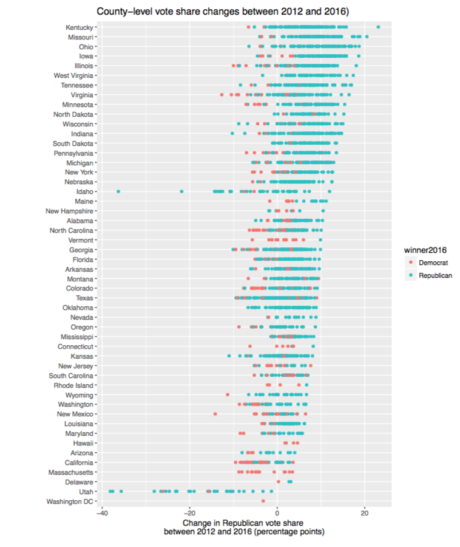

## U.S. voting behavior over time (1916-2016). How competitive are U.S. presidential elections?

The objective of this project is to create a set of graphs that comply with the principles of good data visualization: namely, the charts should be *insightful*, but also *simple* enough for readers to digest the main message of each exhibit.

**Main product**: A self-contained Shiny app shows how the number "swing states" hinges on what we choose to count as a competitive election (at the state level). Most data journalists and researchers use data for recent elections; the app present will allow you to look at patterns for the last 25 U.S. presidential elections.

Access the set of visualizations via [shinyapp.io](https://zilinsky.shinyapps.io/how_competitive_are_us_elections/), or see the animations below.

**Product 2**: Using sankey plots, display county-level vote changes between 2012 and 2016. The user can choose to focus on a particular state, or to select counties that meet a specific condition.

**Third**, I represent recent election results, with `ggplot`.

```{r Setup, include=FALSE, results='hide', warning=FALSE}
library(knitr)
library(tidyverse)
library(ggthemes)
library(ggrepel)
library(viridis) # Some useful color palettes
library(forcats) # This is needed for fct_reorder(f,x,fun)
library(ggridges) # this used to be the ggjoy package
library(ggjoy) # this is only needed for theme_joy(), not for joyplots themselves
library(waffle) # for making square / waffle charts

# Interactive viz
library(htmlwidgets)
library(DT)
library(d3heatmap)
#library(dygraphs)

opts_chunk$set(fig.path="images/",
               cache.path="cache/",
               cache=FALSE,
               echo=TRUE,
               message=FALSE,
               warning=FALSE)  

# Load own theme
jz.theme <- function(base_size = 9, base_family = "",
                     grid.x_colour = NA, grid.y_colour = NA,
                     grid.x_linetype = 1, grid.y_linetype = 1,
                     background_colour = "transparent",
                     plot_background_colour = "transparent",
                     tick_colour = "black", tick_length = 0.2){
  theme(
    axis.text=element_text(size=12), # Increase the size of labels
    axis.title=element_text(size=14), # Increase the size of axis titles
    axis.title.x = element_text(vjust=.5,hjust=.8), # Move x-axis title to the right 
    axis.title.y = element_text(vjust=.5,hjust=.8), # Move y-axis title up
    panel.background = element_blank(),
    legend.key = element_blank(),
    legend.key.size = unit(0.7, "lines"),
    legend.text = element_text(family = base_family, size = base_size, face = "plain", lineheight = 1),
    legend.text.align = -1, 
    legend.title = element_blank(),
    legend.title.align = 1,
    legend.position = "top",
    legend.direction = "horizontal",
    legend.justification = c(0, 1)
  )
}

# Load own colors
jzcolors <- c("deepskyblue4","darkslateblue","cadetblue4","brown3","mediumpurple4")
jz_brewer3cats <- c("#1B9E77","#D95F02","#7570B3")
jz_brewer <- c("#762A83","#C2A5CF","#D9F0D3","#A6DBA0","#5AAE61","#1B7837")
```  

```{r, include=FALSE, results='hide'}
# Load data here
```

## How many states were competitive between 1916 and 2016?

```{r, echo=FALSE}
knitr::include_graphics("charts/Swing_states_US_elections_since_1916_app.gif")
```

### How common were landslides?

In various elections, victories by more than a 20% margin wre common in many states: 


Check the app to explore the pattern for yourself, or to determine which elections were unusual (or when a particular party had an especially difficult year).

See also: `charts/republican_vote_margin.gif)`.

## How many Democratic counties turned red in 2016?

- Are larger (more urban) counties more likely to vote for the Democratic nominee?
- Are larger counties more likely to **stick with** the Democratic nominee?
- How well does the state of the economy predict election outcomes?


### In what states were the blue counties least secure?


## Election visualization with ggplot

*Add charts here...*

```{r, echo=FALSE}
# 
```

## Background information

The first part of the shiny app is built with `highcharter`. In addition to `shiny`, `shinythemes`, `RColorBrewer` and `tidyverse` are used. 

The second part relies on `sankeyNetwork` from the `networkD3` library. The last section uses `datatable` from the `DT` library.

This html document was built with R markdown.

The project is hosted on Github where my website is generated with `Hugo`.

### Data

I have collected and reshaped Democratic and Republican vote share data for most U.S. states between 1916 and 2016 from DataPlanet / U.S. Elections Atlas. If we interactively modify what thresholds count as "close results", how has the proportion of "swing states" changed over time? You can find out using my Shiny App.


## References

### Data

- [Election results](https://github.com/zilinskyjan/US_economy_and_voting/blob/master/voting/election_results/state_vote_shares_by_party.csv), [NYT maps](https://www.nytimes.com/elections/results/president)
- [Economic data from various sources](https://github.com/zilinskyjan/US_economy_and_voting).
- Historical [unemployment rate](https://www.bls.gov/lau/staadata.txt) data from the BLS.

### Research and data journalism

Dean Lacy & Zachary D. Markovich: [Why Don’t States Switch Sides Anymore? The Rise and Fall of American Electoral Volatility](https://cpb-us-east-1-juc1ugur1qwqqqo4.stackpathdns.com/sites.dartmouth.edu/dist/9/280/files/2016/10/Volatility.Simple.v8.pdf)

Philip Bump, [The counties that flipped parties to swing the 2016 election - The Washington Post](https://www.washingtonpost.com/news/the-fix/wp/2016/11/15/the-counties-that-flipped-parties-to-swing-the-2016-election/?utm_term=.0ae6fe611eda)

