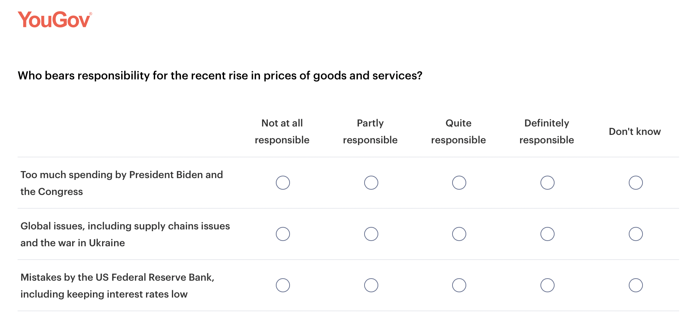
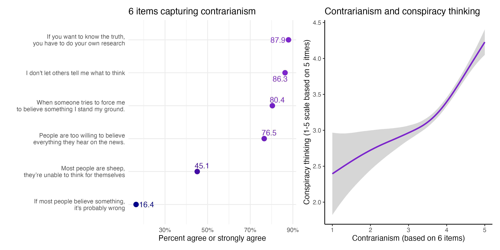
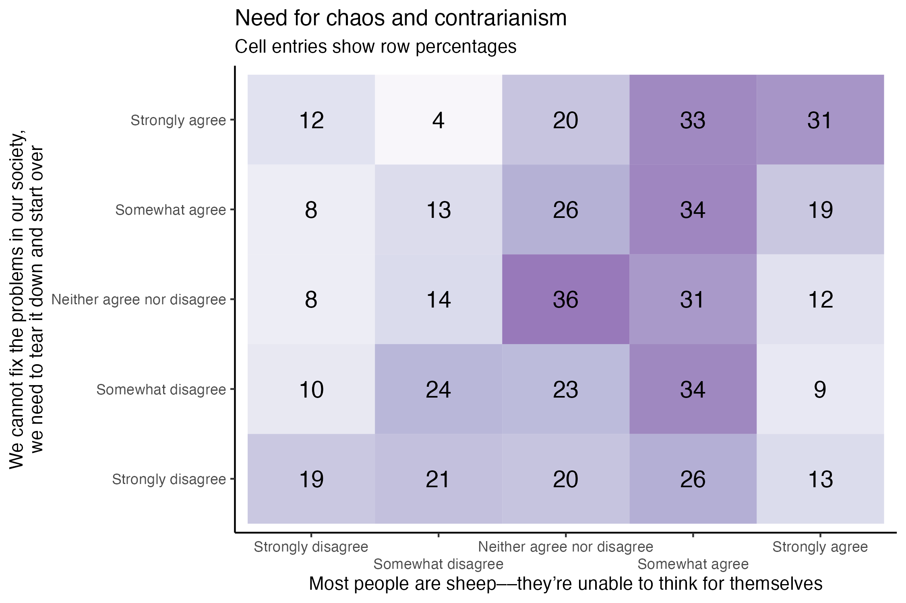
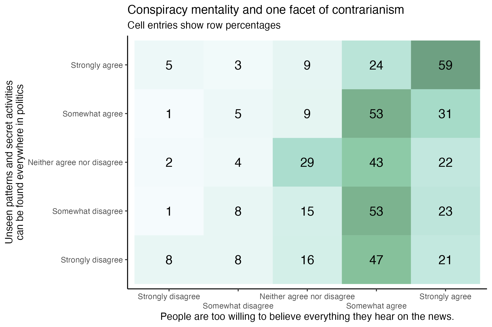

### Attributions of responsibility for inflation

Included the following set of items on a 2022 poll and randomly varied whether Biden was explicitly mentioned or not.

### Anti-technology sentiment (project with Thomas Zeitzoff)

- I am worried that scientists are designing computer programs that could hurt humans.
- Social media has mostly been a bad thing for society because it spreads hate and misinformation.
- The reason our politics is so nasty is because of social media.
- Social media apps can hurt children and teenagers.
- Social media has made us lonelier.
- Most of the social media apps are spying on us.
- Social media makes people jealous of others. 

Reverse-coded:

- Social media has made it easier for me to stay connected with my friends and family.
- Social media platforms can be a powerful tool for activism and social change

### Accusatory & conspiratorial claims

These instruments were included on a survey as part of a project investigating the relationships between social status, victimhood/vulnerability, and beliefs in conspiracy theories:

1. *"Social media companies are hiding the truth about who is really to blame for the conflict in Ukraine."*
2. *"The war in Ukraine was started to benefit companies making and selling weapons."*

### A contrarianism scale (with A. Enders)

1. If you want to know the truth, you have to do your own research.
2. People are too willing to believe everything they hear from the news.
3. I don’t let others tell me what to think.
4. When someone tries to force me to believe something I stand my ground.
5. Most people are basically sheep, unable to think for themselves.
6. If most people believe something, it’s probably wrong.

*5-point scale: Strongly agree; Somewhat agree; Neither agree nor disagree; Somewhat disagree; Strongly disagree.*

### Economic intuitions

Included the following question and items on a 2020 YouGov survey:

*To what extent do you agree with the following statements?*

1. Most economic problems in our country have simple, common-sense solutions.
2. When other countries prosper, it is bad news for America.
3. If someone becomes successful and makes a lot of money, it means that someone else has to make less money.
4. Today, most companies don’t compete for customers, they prey on their customers.
5. Trade with other countries makes most Americans better off because they can buy goods that are assembled cheaply abroad.

5-point scale: Agree strongly; Agree; Neither agree nor disagree; Disagree; Strongly disagree.

### Attitudes toward free speech (with TUM and Oxford collaborators)

- “Self-censorship is never acceptable.” (1-7 scale)
- “Offensive speech can be useful.” (1-7 scale)
- “Comedians should be allowed to say anything.” (1-7 scale)

